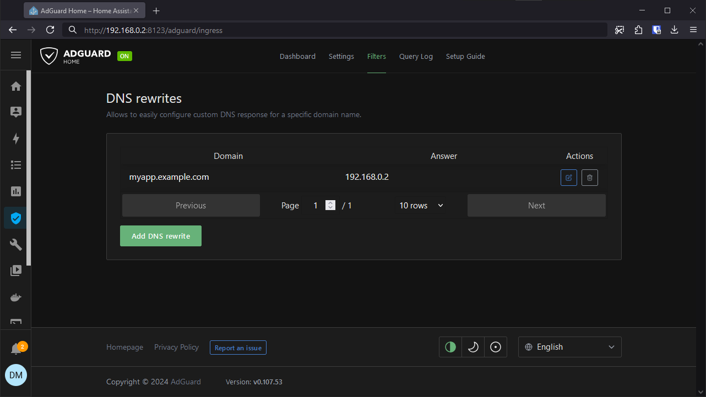

# Reverse Proxy

`myapp.example.com:8080`

To make this all work, we need few other components apart from `RPLB`: Router and DNS Server. I'll describe my setup where I have a Raspberry Pi running Home Assistant and AdGuard Home acting as a DNS Server.

## Router

We can use this example from [AdGuard Home](https://github.com/AdguardTeam/AdGuardHome/wiki/Getting-Started). Similar exists for [Pi-hole](https://discourse.pi-hole.net/t/how-do-i-configure-my-devices-to-use-pi-hole-as-their-dns-server/245).

The important thing here is to point the `Primary DNS` on your Router to the IP adress of DNS Server.

Additionally if we use ... `DHCP Reservation`

## DNS Server

Describe how Router has to point to Home Assistant as DNS Server.

Describe how it works together with Home Assistant + AdGuard Home setup

We need to take advantage of DNS filtering, specifically DNS rewrites

https://adguard-dns.io/kb/general/dns-filtering/

https://adguard-dns.io/kb/general/dns-filtering-syntax/#dnsrewrite-modifier

DNS rewrites - Allows to easily configure custom DNS response for a specific domain name.

AdGuard Home has a page where you can do this.

## RPLB
[Advanced SSH & Web Terminal](https://github.com/hassio-addons/addon-ssh)

ports 80 and 443 are taken by [NGINX Home Assistant SSL proxy](https://github.com/home-assistant/addons/tree/master/nginx_proxy)

Running this will result in Settings warning `Unsupported system - Unsupported software`
https://www.home-assistant.io/more-info/unsupported/software

## How it works?

Reverse proxy extracts host name from the incoming request and tries to find frontend with the same name. On success, reverse proxy finds a backend url connected to that frontends associated backend pool.